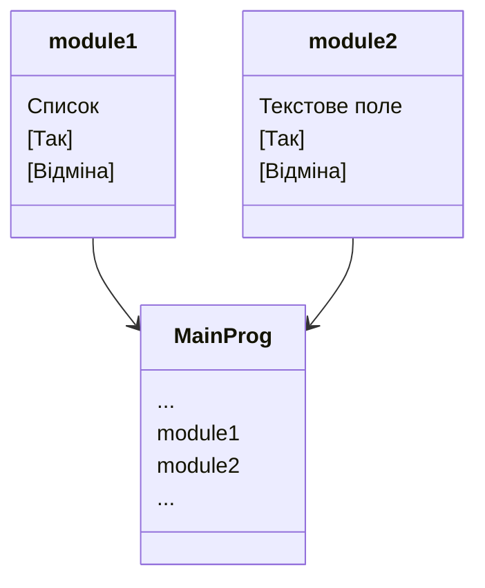

# Lab1
 
### Мета 

Oтримати перші навички створення програм для Windows на основі проєктів з використанням Windows API і навчитися модульному програмуванню


### Завдання

1. Створити проєкт з ім'ям Lab1
2. Написати вихідний текст програми згідно варіанту завдання
3. Скомпілювати вихідний текст і отримати виконуваний файл програми
4. Перевірити роботу програми. Налагодити програму
5. Проаналізувати та прокоментувати результати та вихідний текст програми


### Структура проєкту з двох модулів



--- 

```text 
📁Lab1
├──📝 main.py
├──📝 module1.py
├──📝 module2.py
└── 📍README
```

## Умови

<!-- 1. Потрібно, щоб при виборі пункту меню ``Робота1`` виконувалося щось згідно варіанту ``В1``, причому ``В1`` обчислюється за формулою ``B1 =Ж mod 4``, де ``Ж`` - номер студента у журналі, ``mod`` - залишок від ділення

2. Запрограмувати також, щоб при виборі пункту меню ``Робота2`` виконувалося щось згідно варіанту ``В2``: ``B2=(Ж+1) mod 4`` -->

1. Вихідний текст функції ``В1`` запрограмувати в окремому модулі, а вихідний текст для функції ``В2`` - у іншому окремому модулі. Таким чином, проєкт повинен складатися з головного файлу ``Lab1`` та ще, як мінімум, двох файлів модулів з іменами ``module1`` тa ``module2``. 

> Примітка: кожне вікно діалогу повинно бути в окремому незалежному модулі, тому якщо ``В1 = 2``, або ``В2 = 2`` то має бути, як мінімум, три модуля.

2. Callback-функції вікон діалогу не мають бути видимими зовні модулів - це внутрішні подробиці модулів, треба сховати їх, оголошуючи словом ``static``. Також не можна виносити за межі модулів ресурси - опис вікон діалогу. Це забезпечується тим, що для кожного модуля ``moduleX`` має бути власний файл ресурсів ``moduleX``.

4. Якщо виводиться наступне вікно діалогу, то попереднє вікно повинно закриватися

5. Намалювати повну ієрарxiю усіх наявних файлів проєкту (враховувати тільки ті файли, які відображаються у вікні Solution Explorer).
Главный файл должен импортировать все модули, но дочерние модули не могут импортировать другие файлы 

## Варіант завдання - 15

- B1 = 15 mod 4 = 3
- B2 = (15 + 1) mod 4 = 0

### B1 = 3

- **Що треба зробити:**
Вікно діалогу з елементом списку ``(List Box)`` та двома кнопками: ``[Так]`` і ``[Відміна]``. У список автоматично записуються назви груп нашого факультету. Якщо вибрати потрібний рядок списку і натиснути ``[Так]``, то у головному вікні повинен відображатися текст вибраного рядка списку.

> **Підказка:** 
Занесення рядка у список:
``SendDlgItemMessage(hDlg, id, LB_ADDSTRING, 0, (LPARAM)text)``

Читання елементу списку. Спочатку індекс
рядка, що вибрано: 
``indx = SendDlgItemMessage(hDlg, id, LB_GETCURSEL, 0, 0);``
а потім взяття indx-го рядка тексту: 
``SendDlgItemMessage(hDlg, id, LB_GETTEXT, indx, (long)buf);``

Вивести текст у головному вікні - функцією
``TextOut`` в обробнику для ``WM_PAINT``

### B2 = 0

- **Що треба зробити:**
Вікно діалогу для вводу
тексту, яке має стрічку вводу
(Edit Control) та дві кнопки:
[Так] і [Відміна]. Якщо ввести
рядок тексту і натиснути [Так],
то у головному вікні повинен
відображатися текст, що був
введений.

> **Підказка:** 
Взяти від стрічки вводу рядок тексту - функція ``GetDlgItemText``
Вивести текст у головному вікні - функція ``TextOut`` ``WM_PAINT`` в обробнику повідомлення

---
