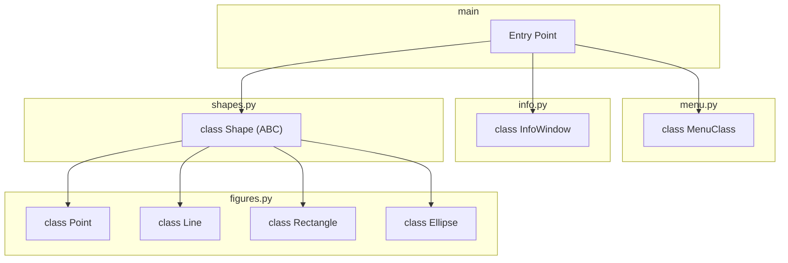

# Lab2
 
### Мета

Отримати вміння та навички використовувати інкапсуляцію, абстракцію типів, успадкування та поліморфізм на основі класів, запрограмувавши простий графічний редактор в об’єктно-орієнтованому стилі


### Завдання

1. Створити проект з ім'ям Lab2
2. Скомпілювати проект і отримати виконуваний файл програми
3. Перевірити роботу програми. Налагодити програму
4. Проаналізувати та прокоментувати результати та вихідний текст програми
5. Оформити звіт

---

## Варіант завдання — №15 (Ж = 15)

Усі параметри обчислено за формулами для номера за журналом **Ж = 15**:

| Параметр | Умова за варіантом | Розрахунок |
| :--- | :--- | :--- |
| Масив для збереження об'єктів | Динамічний масив (Shape) | $15 \pmod 3 = 0$ |
| Кількість елементів масиву (N) | 115 об'єктів | $N = 15 + 100$ |
| «Гумовий» слід | Лінія чорного кольору | $15 \pmod 4 = 3$ |
| Введення прямокутника | Від центру до одного з кутів | $15 \pmod 2 = 1$ |
| Відображення прямокутника | Чорний контур | $15 \pmod 5 = 0$ |
| Кольори заповнення прямокутника | Рожевий | $15 \pmod 6 = 3$ |
| Введення еліпса | По двох протилежних кутах охоплюючого прямокутника | $15 \pmod 2 = 1$ |
| Відображення еліпса | Чорний контур | $15 \pmod 5 = 0$ |
| Кольори заповнення еліпсу | Блакитний | $15 \pmod 6 = 3$ |
| Позначка обраного інструмента | У заголовку вікна | $15 \pmod 2 = 1$ |

---

### Детальні вимоги до реалізації

1. **Головне меню програми:**
   - Меню **«Об'єкти»** розташовується праворуч від меню **«Файл»** та ліворуч від меню **«Довідка»** (`Файл` $\to$ `Об'єкти` $\to$ `Довідка`).
   - Підпункти меню «Об'єкти» містять назви українською мовою:
     1. **Крапка**
     2. **Лінія**
     3. **Прямокутник**
     4. **Еліпс**

2. **Індикація поточного інструмента:**
   - Поточний обраний тип геометричної фігури відображається **в заголовку головного вікна** (наприклад: `Графічний редактор - [Прямокутник]`).

3. **Сховище фігур:**
   - Збереження створених об'єктів здійснюється через **динамічний масив** вказівників на базовий тип `Shape` місткістю **115 елементів** (`N = 115`).

4. **«Гумовий» слід при малюванні:**
   - Під час переміщення курсора миші з затиснутою кнопкою (до фіксації фігури) динамічний контур малюється **пунктирною лінією чорного кольору**.

5. **Особливості введення та відображення фігур:**
   - Крапка: малюється за координатами кліку миші.
   - Лінія: малюється від початкової точки натискання до точки відпускання кнопки.
   - Прямокутник:
     - Введення: від центру до одного з кутів (точка натискання — центр, точка відпускання — кут).
     - Відображення: чорний контур із білим заповненням.
   - Еліпс: 
     - Введення: за двома протилежними кутами охоплюючого прямокутника.
     - Відображення: чорний контур без заповнення (прозорий всередині).

---

### Схема успадкування



### Структура проекту

```text 
📁Lab2
├──📝 main.py
├──📝 menu.py
├──📝 info.py
├──📝 shapes.py
├──📝 figures.py
└── 📍README.md
```